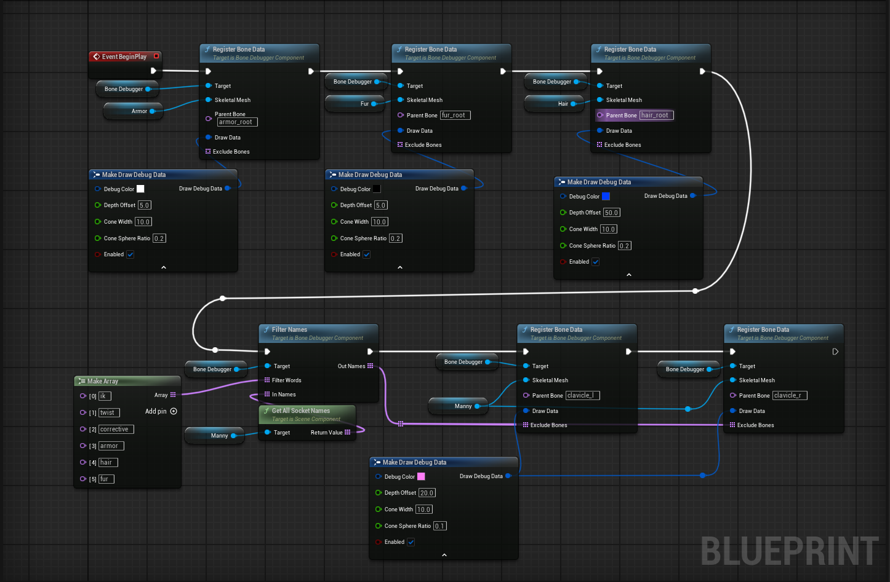
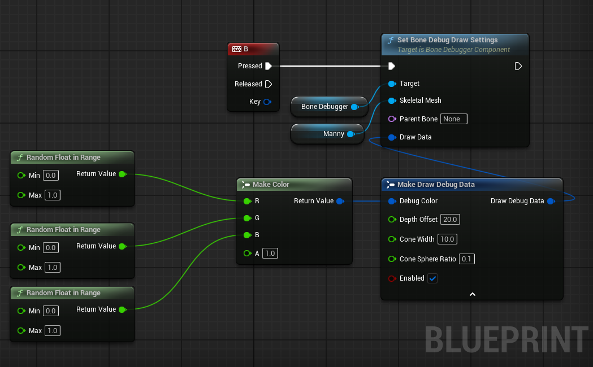

# DebugBones Plugin

A Unreal Engine plugin for debugging skeletal mesh bones in the game world.

## Description

DebugBones is a custom plugin that provides tools to visualize and debug bone hierarchies in skeletal meshes. It allows developers to draw debug cones and spheres representing bone positions and orientations, making it easier to understand and troubleshoot skeletal animations and rigging.

## Features

- **Bone Hierarchy Visualization**: Draw debug shapes for entire bone trees starting from a specified parent bone.
- **Customizable Debug Drawing**: Adjust colors, sizes, cone angles, sphere radius, and depth offsets.
- **Blueprint Integration**: Fully exposed to Blueprints with callable functions for easy setup.
- **Performance Conscious**: Only draws when enabled and in debug builds (uses ENABLE_DRAW_DEBUG).
- **Filtering Options**: Exclude specific bones from visualization.
- **Runtime Modification**: Change draw settings dynamically during gameplay.

## Installation

1. Copy the `DebugBones` folder into your Unreal Engine project's `Plugins` directory.
2. Restart the Unreal Engine Editor or regenerate project files.
3. Enable the plugin in the Plugins menu (Edit > Plugins > Project > Other > DebugBones).
4. Rebuild your project if necessary.

## Requirements

- Unreal Engine 4.27+ or 5.x
- Works with any project that uses skeletal meshes

You can follow this tutorial to build for different versions of Unreal
[](https://youtu.be/sC0gnfYzFzU)

## Usage

### Basic Setup

1. Add the `UBoneDebuggerComponent` to an actor that has a skeletal mesh component.
2. In the component's properties, ensure `bEnableDrawBones` is checked.
3. In BeginPlay (or via Blueprints), call `RegisterBoneData` to set up the bones to debug.

### Blueprint Example

1. **Register Bone Data**:
   - Call `RegisterBoneData` with:
     - SkeletalMesh: Reference to your USkeletalMeshComponent
     - ParentBone: The top bone of the hierarchy you want to debug (e.g., "root" or "pelvis")
     - DrawData: Struct with your preferred debug settings
     - ExcludeBones: Array of bone names to skip (optional)



2. **Modify Settings at Runtime**:
   - Use `SetBoneDebugDrawSettings` to change colors, sizes, etc., while the game is running.



3. **Filter Bone Names**:
   - Use `FilterNames` to find bones containing specific keywords.

### C++ Usage

```cpp
// In your actor's BeginPlay
FDrawDebugData DrawSettings;
UBoneDebuggerComponent* Debugger = NewObject<UBoneDebuggerComponent>(this);
Debugger->RegisterBoneData(SkeletalMeshComponent, FName("root"), DrawSettings, ExcludedBones);
```

## API Reference

### UBoneDebuggerComponent

#### Properties
- `BonesData`: Array of registered bone debug data
- `bEnableDrawBones`: Master toggle for drawing

#### Functions
- `RegisterBoneData(USkeletalMeshComponent*, FName, FDrawDebugData, TArray<FName>)`: Register bones for debugging
- `SetBoneDebugDrawSettings(USkeletalMeshComponent*, FName, FDrawDebugData)`: Update draw settings
- `FilterNames(TArray<FName>, TArray<FName>, TArray<FName>&)`: Filter bone names by keywords

### FDrawDebugData Struct
- `DebugColor`: Color of the debug shapes
- `DepthOffset`: Offset from camera for visibility
- `ConeWidth`: Width of the cone in degrees
- `ConeSphereRatio`: Ratio for sphere size relative to cone
- `Enabled`: Individual enable toggle

## Tips

- Use different colors for different bone hierarchies to distinguish them.
- Adjust `DepthOffset` to prevent shapes from clipping into geometry.
- Disable drawing in shipping builds by checking `ENABLE_DRAW_DEBUG`.
- Combine with Unreal's built-in debug drawing functions for more comprehensive debugging.

## Troubleshooting

- Ensure the plugin is enabled and the project is rebuilt.
- Check that the skeletal mesh has the specified parent bone.
- Verify that `bEnableDrawBones` is true and the component is active.

## Author

Hossam Eldin Nasser
